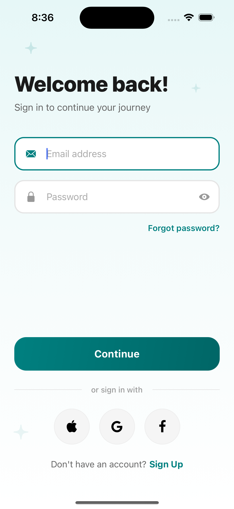
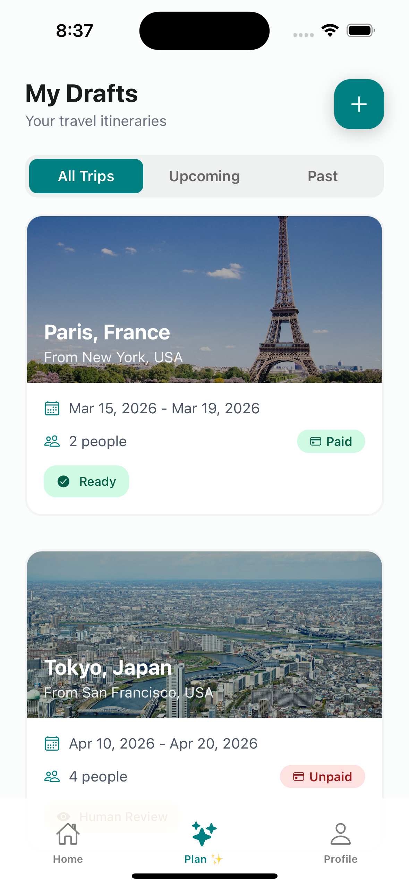
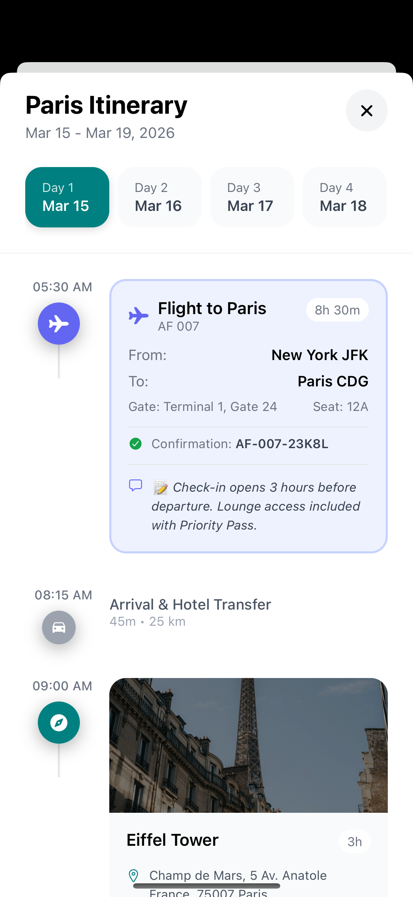
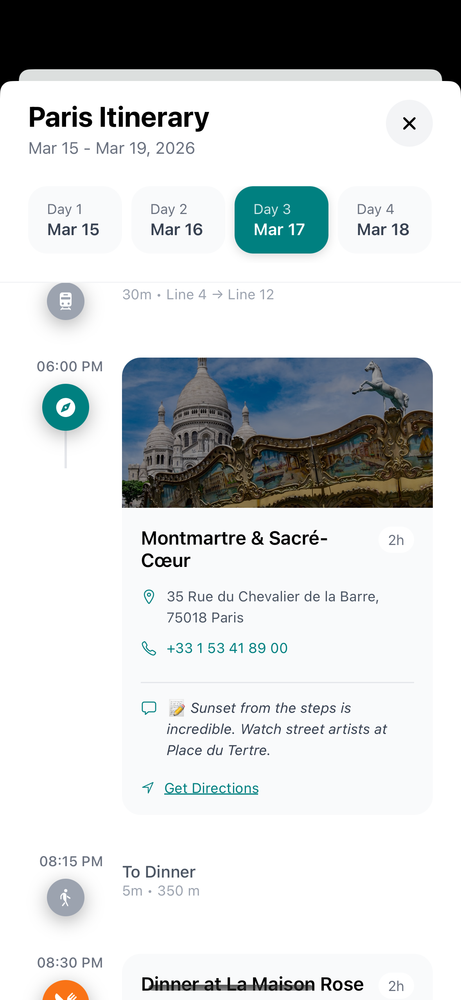

# Akinrak 🌍✈️

Akinrak is an AI-powered travel planner and itinerary generator built with **Expo** and **React Native**. It aims to simplify trip planning by leveraging AI to generate, later-on real human will verify, and organize customized travel itineraries.

> **Note:** This project is currently in active development.

## 🚀 Current Status

The foundational structure of Akinrak is laid out, with the following core components successfully integrated:

-   **Authentication:** Fully implemented using **Clerk** for secure user onboarding and session management.
-   **User Interface:** The **Final Itinerary UI** is complete, providing a clean, intuitive, and mobile-responsive presentation of the generated travel plans.

|                               Sign Up                                |                                Login                                 |                               Plan Tab                               |
| :------------------------------------------------------------------: | :------------------------------------------------------------------: | :------------------------------------------------------------------: |
|       |           |              |
|                              **Day 1**                               |                              **Day 2**                               |                              **Day 3**                               |
|  |  |  |

## 🗺️ Roadmap & Next Steps

The immediate next phase focuses on the core AI engine and robust background processing:

-   [ ] **AI Planner MVP:** Develop the minimum viable product for the AI engine to generate contextual travel itineraries based on user preferences.
-   [ ] **Queue Implementation:** Set up a background queue system to handle the asynchronous generation and verification of trips. This ensures that the AI outputs are validated and structured properly before being presented to the user, without blocking the main UI thread.

## 🛠️ Tech Stack

-   **Framework:** Expo / React Native
-   **Language:** TypeScript
-   **Authentication:** Clerk
-   **Package Manager:** pnpm
-   **AI & Processing:** _Upcoming (AI Planner API & Queue-based verification)_

## 💻 Getting Started

To run this project locally, ensure you have Node.js and `pnpm` installed.

1. **Clone the repository:**

    ```bash
    git clone [https://github.com/shivxbhagat/akinrak.git](https://github.com/shivxbhagat/akinrak.git)
    cd akinrak

    ```

2. Install dependencies

    ```bash
    pnpm install
    ```

3. Set up Environment Variables

    Create a `.env` file in the root of the project and add the necessary environment variables.

    ```bash
    EXPO_PUBLIC_CLERK_PUBLISHABLE_KEY=your_clerk_publishable_key
    ```

4. Start the app

    ```bash
    npx expo start
    ```

    or

    ```bash
    pnpm start
    ```

    In the terminal output, you'll find options to open the app in an Android emulator, iOS simulator, or via Expo Go on your physical device.

## 🤝 Contributing

As the project is currently in its early MVP stages, the main focus is establishing the UI, AI and queue architecture with a normal working backend. Feel free to open issues for suggestions or bug reports regarding the UI and auth flow!
